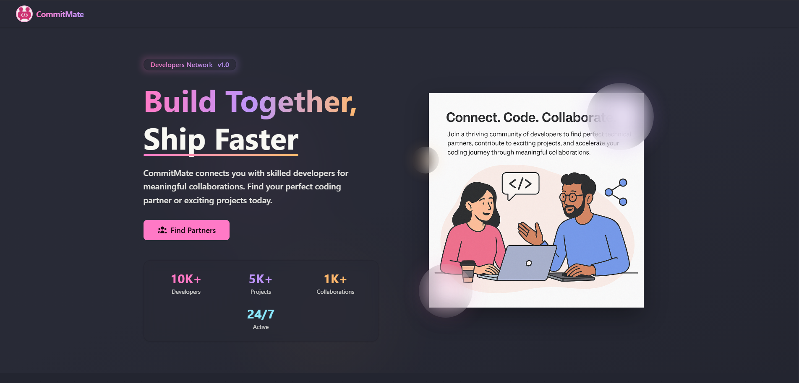

<h1 align="center">
  <br>
  CommitMate
  <br>
</h1>

<div align="center">
  <a href="https://github.com/soumadip-dev">
    
  </a>
</div>

<h3 align="center">
CommitMate is a developer networking platform for connecting with like-minded professionals, managing profiles, and fostering technical collaborations.
</h3>

---

<p align="center">
  
</p>

---

## 🌟 Features

- 🔐 **User Authentication** – Secure sign-up and login with JWT-based authentication.
- 👤 **Profile Management** – Create and personalize user profiles showcasing skills and project experience.
- 🌐 **Explore Feed** – Browse and discover other developers based on their profiles.
- 🤝 **Connection Requests** – Send connection requests and build your developer network.
- 📬 **Request Tracking** – Monitor all sent connection requests.
- 🧩 **Matches Overview** – View mutual matches and existing connections.

---

## 🛠 Tech Stack & Architecture

CommitMate follows a **microservices architecture** to ensure modularity and scalability:

- **Frontend**: React.js with Redux for state management, styled using Tailwind CSS and DaisyUI.
- **Backend**: Node.js with Express.js for building RESTful APIs.
- **Database**: MongoDB with Mongoose for schema-based data modeling.
- **Authentication**: Secure JWT-based token authentication with cookie management.
- **Deployment**: Plans to deploy on **Vercel** (Frontend) and **Render** or **Railway** (Backend).

---

## ⚙️ Environment Variables

> Create a `.env` file inside the `backend` directory with the following keys:

```
########## SERVER CONFIGURATION ##########
PORT=

########## DATABASE CONFIGURATION ##########
MONGO_URI=

########## AUTHENTICATION CONFIGURATION ##########
ACCESS_TOKEN_SECRET=
ACCESS_TOKEN_EXPIRY=
COOKIE_MAX_AGE=
```

> Create a `.env` file inside the `frontend` directory with the following keys:

```
########## BACKEND CONFIGURATION ##########
VITE_BASE_URL=
```

<!-- ## 📡 API Endpoints

### 🔐 Authentication

| Method | Endpoint       | Description            |
| ------ | -------------- | ---------------------- |
| POST   | `/auth/signup` | Register a new user    |
| POST   | `/auth/login`  | Log in to an account   |
| POST   | `/auth/logout` | Log out of the session |

---

### 👤 Profile Management

| Method | Endpoint                 | Description                 |
| ------ | ------------------------ | --------------------------- |
| GET    | `/profile/view`          | View current user's profile |
| PATCH  | `/profile/edit`          | Edit profile information    |
| PATCH  | `/profile/resetpassword` | Reset account password      |
| DELETE | `/profile`               | Delete user profile         |

---

### 🤝 Connection Requests

| Method | Endpoint                               | Description                    |
| ------ | -------------------------------------- | ------------------------------ |
| POST   | `/connection/send/like/:userId`        | Send a "like" request          |
| POST   | `/connection/send/pass/:userId`        | Send a "pass" (ignore) request |
| POST   | `/connection/review/match/:requestId`  | Accept a connection request    |
| POST   | `/connection/review/reject/:requestId` | Reject a connection request    |

---

### 👥 User Networking

| Method | Endpoint            | Description                       |
| ------ | ------------------- | --------------------------------- |
| GET    | `/user/requests`    | View received connection requests |
| GET    | `/user/connections` | View established connections      |
| GET    | `/user/feed`        | Discover new developers           |

--- -->
